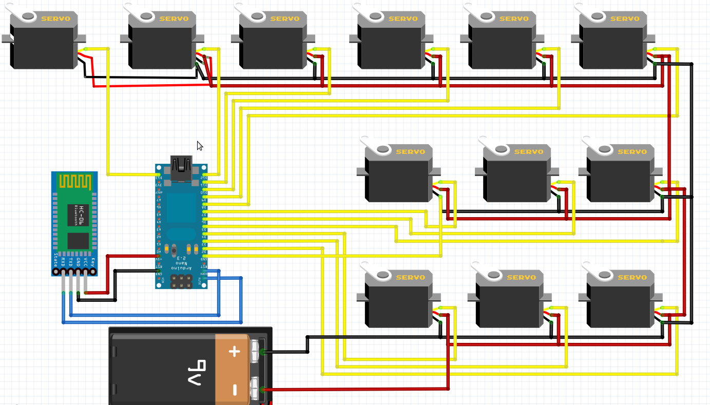
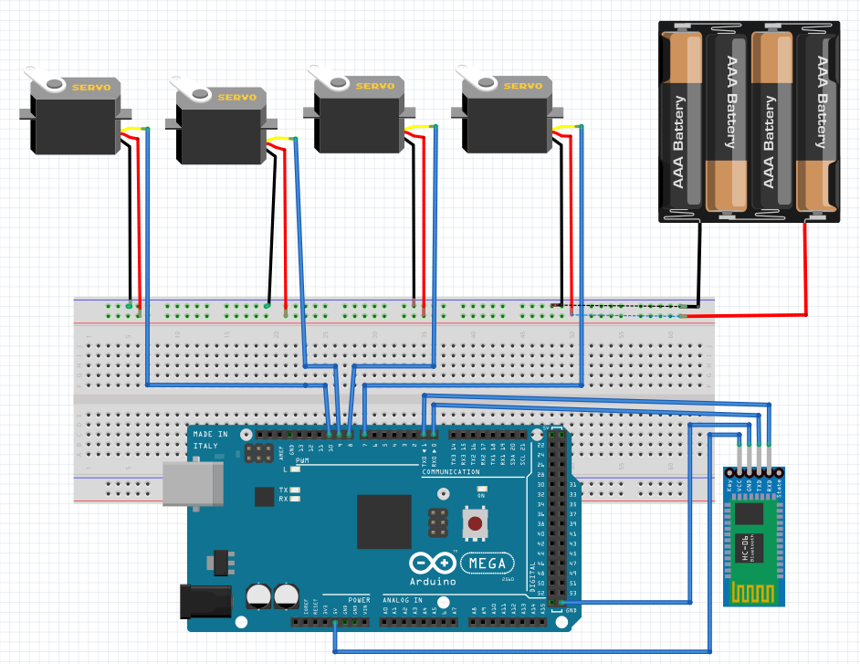

## PROYECTOS EN ARDUINO
Los siguientes proyectos estan Basados en codigo de Arduino.

### Araña Robot

Se pueden observar algunos principios básicos de movimiento en extremidades, debido que para que este prototipo tenga un movimiento más optimo, tinen que poder realizar movimientos no forzados para los diferentes servomotores.

|                LISTA DE MATERIALES            |
| --------------------------------------------- |
|  Electrónica | Cantidad |  Mecánica  | Cantidad |
| :------------ | --------: | :---------  | --------: |
| Servo Motor  |    12    |Piezas en Acrilico| x |
| Arduino nano |     1    |Tornillo Stovebolt 3/16 x 1 | 6 |
| HC-06 |    1    | Tornillo autorroscante 3/32 X ¼  | 16  |
| Jumpers |     x    |
| Placa para Nano |    1    | 
| Porta pilas 9v |     1  |
| Pila 9v |     1    |

#### Esquematico

  

### Brazo Robot

El diseño del código esta planteado para un tipo de brazo robot, el cual esta anexado en su carpeta por si desean hacer la impresion en 3D.
Tomar en cuenta que dos de los 4 servomotores se encuentran a una misma altura.

|                LISTA DE MATERIALES            |
| --------------------------------------------- |
|  Electrónica | Cantidad |  Mecánica  | Cantidad |
| :------------ | --------: | :---------  | --------: |
| Servo Motor  |    12    |Piezas en Acrilico| x |
| Arduino nano |     1    |Tornillo Stovebolt ⅛ x ¾ | 8 |
| HC-06 |    1    | Tuerca hexagonal ⅛  | 8  |
| Jumpers |     x    |  Tornillo 3/16 x ¾| 1 |
| Protoboard |    1   | Tuerca Stovebolt 3/16| 8   |
| Porta pilas 9v |     1  |Tornillo Stovebolt 3/16 x 1/2| 7|
| Pila 9v |     1    |

#### Esquematico

  

<!-- # Proyectosgit -Arduino -->
